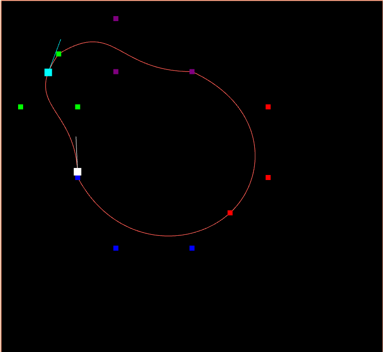

# Spline Praticing
Be sure you have [node and npm](https://nodejs.org/en/download) installed.<br>
If you don't have `tsc` installed, you can install with the command <br>
```npm install -g typescript```<br>
To run first compile the files inside `src` folder with `tsc`, to get the `.js` files.
<br>
```
git clone https://github.com/JelsonRodrigues/webgl_bezier_spline
cd webgl_bezier_spline/src
tsc
cd ..
npm install
node ./server.ts
```

Now open your browser in the link `localhost:3000/index.html`

# Demo
